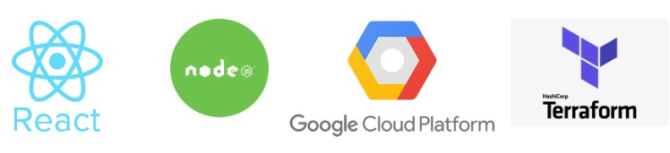
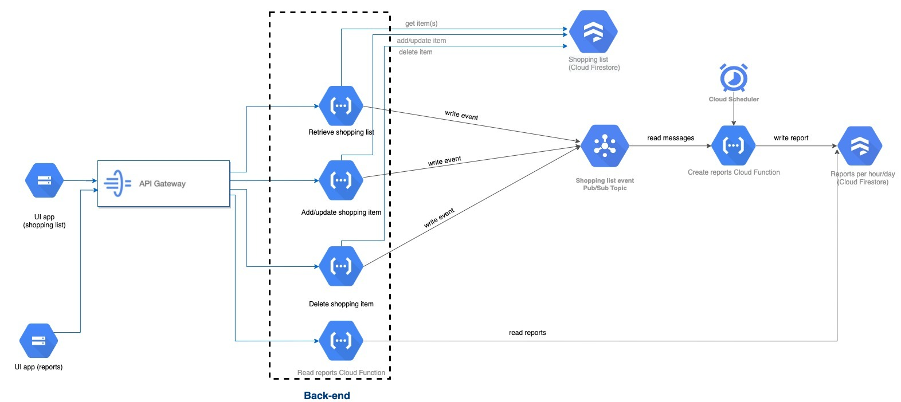

# GCP Serverless shopping list app

A project containing a ready-to-deploy serverless app.

## Table of Contents
- [1. Introduction](#introduction)
- [2. Deployment](#deployment)
- [3. Stack](#stack)
    * [3.1 Infrastructure](#infrastructure)
    * [3.2 Frontend](#frontend)
    * [3.3 Backend](#backend)
- [4. Diagram](#diagram)

### 1. Introduction
Shopping-list-serverless is a proof of concept application which enables you to add/update/delete items from a shopping list. 

### 2. Deployment

To get started with the Serverless shopping list application, you can deploy into your GCP Account by following the [Get Started instructions](./docs/getting_started.md)

### 3. Stack

Summary of what the stack looks like now including a picture with the core tech:

* **Front-end** - React.js as the core framework.
* **Data** - All data is stored in a serverless db (Google Firestore).
* **API** - GCP API Gateway
* **Messaging** - Shopping workflow is managed by Cloud Funtions, while PubSub provides, together with Cloud Scheduler, a way to communicate with the reporting part of the application.

### 3. Diagram
#### High level infrastructure architecture

